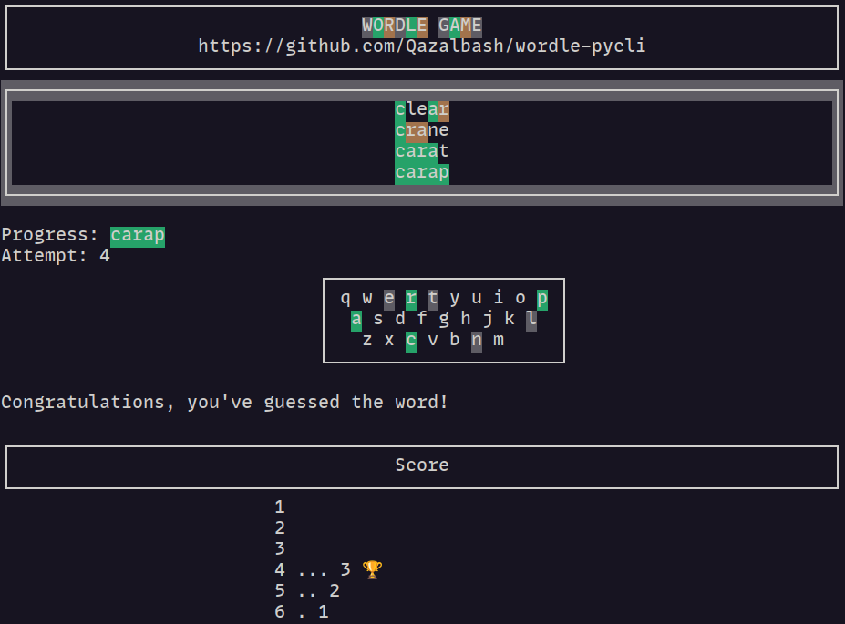

# Wordle PyCLI Game


Welcome to the Wordle CLI Game! Experience the classic word-guessing game right in your command line. This version of Wordle is a command-line-based simulator that brings the fun of word puzzles to your terminal.



## Features

- 🌈 Colorful CLI interface with a fancy keyboard display
- ⭐ Dynamic word revealing based on correct guesses
- 🎯 Attempts tracking with a stylish game board
- 📊 Progression with each guess visually represented

## Installation

To play Wordle CLI Game, you need to have Python installed on your system. If you don't have Python installed, you can download it from [python.org](https://www.python.org/downloads/).

```bash
pip3 install --upgrade wordle-pycli
```

## Usage

```bash
wordle-pycli
```

## Contributing

Contributions are welcome! Please feel free to submit a Pull Request. For major changes, please open an issue first to discuss what you would like to change.
